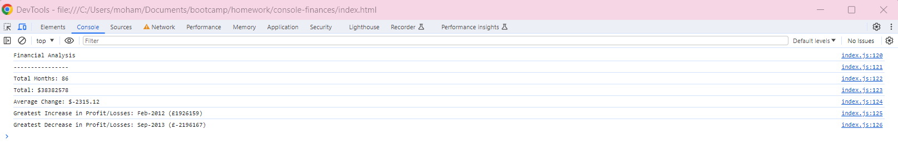

# Using JavaScript to analyze financial records of a company.

## Created to emulate an exercise of a real-world situation in which new JavaScript skills can be displayed.

The aim of this exercise was to showcase an understanding of JavaScript fundamentals such as the Console Log, Variables, Logical Operators, Arrays, If statements, Data Types and For Loops.

In this project it was required that using these fundamentals to analyse the financial records of a company highlighting:

* Total Months
* Total Profit
* Average Change
* Greatest Increase in Profit/Losses 
* Greatest Decrease in Profit/Losses

## Table of Contents

* [Installation](#installation)
* [Usage](#usage)
* [Credits](#credits)
* [License](#license)

## Installation

* Go onto 'https://github.com/mrahman676/Console-Finances' and clone the repo into your terminal
* Create a folder within your local drive to save the repo in using mkdir 'file-name'
* Use code . to open it in your code editor (mine is VS Code)

## Usage 

* You can find the HTML document (index.html)and the JavaScript file (index.js) within the 'console-finances' document.
* The HTML links to the index.js file for which when you run the index.html file you can see the results of the index.js on the windows terminal.
* Within the index.js file, the working out in sectioned by assigned variables, functions such as if statements & for loops, and console.logs to print the results.

Please check out a preview of the page here:

## Credits

For Pod 4 in Class Session 08/12/2023 by Edx Front End for help in collaborating ideas in completing challenge.

## License

MIT License 2023

For more info please refer to: https://snyk.io/learn/what-is-mit-license/#what-is

## Badges

